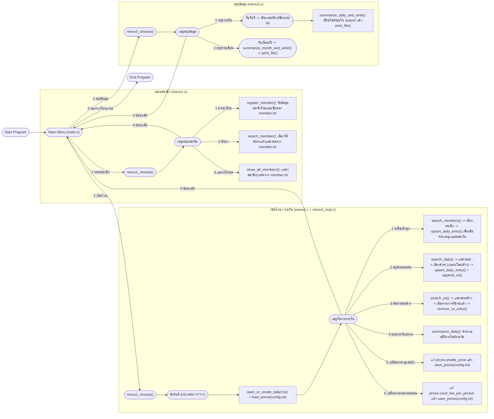

# Badminton Group Payment System – Code Summary

ระบบจัดการก๊วนแบดมินตันสำหรับเก็บข้อมูลสมาชิก ลงชื่อเบิกลูก คำนวณค่าใช้จ่ายรายวัน/รายเดือน และจัดการยอดค้างชำระ  
ทั้งหมดเขียนด้วยภาษา C และใช้ไฟล์ `.txt` เป็นฐานข้อมูลแบบง่าย ๆ

ไฟล์สรุปนี้ใช้สำหรับเป็น `README.md` บน GitHub หรือรายงานประกอบโปรเจกต์ได้เลย

---

## 1. โครงสร้างโปรเจกต์

> โครงนี้อิงจากชุดไฟล์ล่าสุดที่ใช้อยู่ตอนนี้

```text
main.c              # จุดเริ่มต้นของโปรแกรม / เมนูหลัก

delay.h
delay.c             # ฟังก์ชัน delay() หน่วงเวลา

menu1.h
menu1.c             # ระบบสมาชิก (ลงทะเบียน / ค้นหา / แสดงทั้งหมด)

menu2.h
menu2.c
menu2_impl.c        # ระบบเปิดก๊วน + จัดการไฟล์รายวัน + OS (ค้างชำระ)

menu3.h
menu3.c             # ระบบสรุปข้อมูล (รายวัน / รายเดือน)

member.txt          # ข้อมูลสมาชิก
config.txt          # ราคาลูกแบด + ค่าสนามต่อคน
OSpayment.txt       # ยอดค้างชำระทั้งหมด
<DATE>.txt          # ไฟล์รายวัน เช่น 20-11-2025.txt
output/
  ├─ <DATE>.สรุปแบบละเอียด.txt
  ├─ <DATE>.สรุปแบบย่อ.txt
  └─ <MM-YYYY>.สรุปรายเดือน.txt
```

---

## 2. ภาพรวมการทำงานของระบบ

1. โปรแกรมเริ่มทำงานที่ `main.c`
   - แสดงเมนูหลักของโปรแกรม
   - ให้ผู้ใช้เลือกว่าจะไปใช้เมนูไหน
   - เรียก `menu1_choose()`, `menu2_choose()`, `menu3_choose()` ตามตัวเลขที่เลือก
   - สามารถกด `0` เพื่อออกจากโปรแกรม

2. แบ่งเป็น 3 โมดูลหลัก

   - **เมนู 1 – ระบบสมาชิก** (`menu1.c`, `menu1.h`)  
     เก็บรายชื่อสมาชิกลงไฟล์ `member.txt`  
     - ลงทะเบียนสมาชิกใหม่  
     - ค้นหาสมาชิก  
     - แสดงสมาชิกทั้งหมด  

   - **เมนู 2 – เปิดก๊วน / จัดการรายวัน** (`menu2.c`, `menu2_impl.c`, `menu2.h`)  
     ทำงานกับไฟล์รายวัน `<DATE>.txt` และไฟล์ยอดค้าง `OSpayment.txt`  
     - ลงชื่อเบิกลูกในแต่ละวัน  
     - คำนวณยอดที่ต้องจ่าย/ยอดที่จ่ายแล้ว  
     - แยกวิธีชำระ (เงินสด / โอน / ค้างจ่าย)  
     - บันทึกยอดค้างลง `OSpayment.txt`  
     - ปรับราคาลูกแบดและค่าสนามต่อคน  

   - **เมนู 3 – สรุปข้อมูล** (`menu3.c`, `menu3.h`)  
     สร้างรายงานสรุปจากไฟล์รายวัน/ไฟล์ยอดค้าง  
     - สรุปรายวัน (แบบมีรายชื่อและแบบย่อ)  
     - สรุปรายเดือน (รวมทั้งเดือน)

---

## 3. อธิบายโค้ดและฟังก์ชันทีละไฟล์

ต่อไปนี้เป็นคำอธิบายโค้ดทุกไฟล์และหน้าที่ของฟังก์ชันแต่ละตัว  
(บางส่วนในไฟล์มี `...` ตัดออกไป แต่โครงทำงานโดยรวมเป็นดังนี้)

---

### 3.1 `main.c` – จุดเริ่มต้นของโปรแกรม / เมนูหลัก

หน้าที่หลักของ `main()` คือเป็น “ศูนย์รวมเมนู” ให้ผู้ใช้เลือกว่าจะไปใช้ระบบไหน

โครงของฟังก์ชัน:

```c
int main() {
    int menu;
    while (1) {
        printf("Badminton Group Payment System\n");
        printf("กรอกหมายเลขเพื่อทำระบบต่อไปนี้\n");
        printf("1.ระบบสมาชิก\n");
        printf("2.เปิดก๊วน\n");
        printf("3.สรุปข้อมูล\n");
        printf("0 เพื่อหยุดโปรแกรม\n");

        scanf("%d", &menu);   // รับตัวเลือกจากผู้ใช้

        if (menu == 1) {
            menu1_choose();   // ไปเมนูระบบสมาชิก
        } else if (menu == 2) {
            menu2_choose();   // ไปเมนูเปิดก๊วน/รายวัน
        } else if (menu == 3) {
            menu3_choose();   // ไปเมนูสรุปข้อมูล
        } else if (menu == 0) {
            break;            // ออกจากลูป -> จบโปรแกรม
        } else {
            printf("กรอกหมายเลขผิดพลาด โปรดลองอีกครั้ง");
        }
    }

    printf("End of program Goodbye :))");
}
```

**สรุปหน้าที่ของ `main()`**

- วนลูปแสดงเมนูหลัก
- อ่านตัวเลขที่ผู้ใช้กรอก
- เรียกฟังก์ชันเมนูย่อยตามตัวเลข
- กด `0` เพื่อจบลูปและปิดโปรแกรม

---

### 3.2 `delay.h` / `delay.c` – ฟังก์ชันหน่วงเวลา

#### ฟังก์ชัน `delay(int number_of_seconds)`

```c
void delay(int number_of_seconds)
{
    int milli_seconds = 1000 * number_of_seconds;
    clock_t start_time = clock();
    while (clock() < start_time + milli_seconds) ;
}
```

**ทำงานอย่างไร**

- รับจำนวนวินาทีที่ต้องการหน่วง (`number_of_seconds`)
- แปลงเป็นมิลลิวินาที `milli_seconds = 1000 * number_of_seconds`
- เก็บเวลาเริ่มต้นด้วย `clock()`
- วนลูปค้างไว้จนกว่าเวลาปัจจุบันจะเกิน `start_time + milli_seconds`
- ใช้เพื่อ “หยุดรอสักพัก” ก่อนจะแสดงข้อความหรือกลับเมนู เช่น แสดง error แล้วดีเลย์ 2–3 วินาที

---

### 3.3 `menu1.h` / `menu1.c` – ระบบสมาชิก

#### 3.3.1 ฟังก์ชันใน `menu1.h`

```c
void input_file();
void register_member();
void search_member();
void show_all_members();
void menu1_choose();
```

ทั้งหมดนี้ implement อยู่ใน `menu1.c`

---

#### 3.3.2 `input_file()` – ตรวจไฟล์สมาชิก

```c
void input_file(){
    FILE *member;
    member = fopen("member.txt","r");
    if(member == NULL){
        printf("fail open");
        return;
    }
    fclose(member);
}
```

- พยายามเปิดไฟล์ `member.txt` แบบอ่าน
- ถ้าเปิดไม่ได้ (ไม่มีไฟล์ / เสียหาย) จะแจ้ง `"fail open"`
- ถ้าเปิดได้ก็ปิดทันที → แปลว่าไฟล์พร้อมใช้งาน

---

#### 3.3.3 `register_member()` – ลงทะเบียนสมาชิกใหม่

> ส่วนนี้ในไฟล์จริงถูกย่อด้วย `...` แต่โครงทำงานหลักคือ:

1. เปิด `member.txt` เพื่ออ่านข้อมูลเดิมทั้งหมด  
   - ใช้เพื่อหา `id` ล่าสุด (last_id)
   - ถ้าไฟล์ยังว่าง → เริ่มจาก id = 1

2. รับ input จากผู้ใช้:
   - ชื่อ–นามสกุล (string)
   - ชื่อเล่น (string)
   - เพศ (เช่น 1=ชาย, 2=หญิง)  
   สามารถทำ validation ว่ากรอกถูกหรือไม่

3. ดึงวันที่ปัจจุบันจากระบบ (`time()`, `localtime()`, `strftime()`) แล้วสร้าง string วันที่ เช่น `20-11-2025`

4. เปิด `member.txt` โหมดเขียนต่อท้าย (`"a"`) แล้วเขียนข้อมูลในรูปแบบ:

   ```text
   id|fullname|nickname|gender|created_at
   ```

5. ปิดไฟล์และแสดงข้อความยืนยันการลงทะเบียน + แสดงรหัสสมาชิกใหม่ให้ผู้ใช้จำ

---

#### 3.3.4 `search_member()` – ค้นหาสมาชิก

โครงทั่วไปของฟังก์ชัน (ตามดีไซน์):

1. แสดงเมนูย่อย:
   - กด 1 = ค้นด้วยรหัสสมาชิก  
   - กด 2 = ค้นด้วยชื่อเล่น  
   - กด 3 = ค้นด้วยชื่อ–นามสกุล  
   - กด 0 = ย้อนกลับเมนูสมาชิก

2. รับตัวเลือกจากผู้ใช้ → แล้วรับคำค้น (`id` หรือ `string`) ตามประเภท

3. เปิด `member.txt` แล้วอ่านทีละบรรทัด:
   - แยกข้อมูลด้วย `sscanf` หรือ `strtok`  
   - เปรียบเทียบฟิลด์ที่สนใจกับค่าที่ผู้ใช้กรอก

4. ถ้ามีสมาชิกที่ตรงเงื่อนไข → แสดงข้อมูลออกทีละคน  
5. ถ้าอ่านจนจบและไม่พบเลย → แสดงข้อความว่า “ไม่พบสมาชิกตามเงื่อนไขที่ค้นหา”

---

#### 3.3.5 `show_all_members()` – แสดงสมาชิกทั้งหมด

- เปิด `member.txt`  
- อ่านทุกบรรทัด  
- แยกข้อมูล id / fullname / nickname / gender / created_at  
- แสดงเป็นตาราง และนับจำนวนสมาชิกทั้งหมด

---

#### 3.3.6 `menu1_choose()` – เมนูระบบสมาชิก

ช่วงท้ายของไฟล์:

```c
...
        }else if(menu1 == 2){
            search_member();
            break;
        }else if(menu1 == 3){
            show_all_members();
            break;
        }else if(menu1 == 0){
            break;
        }else{
            printf("ไม่ตรงกับในเมนูโปรดลองอีกครั้ง");
        }
    }
}
```

โครงเต็มโดยทั่วไปจะเป็นประมาณนี้:

```c
void menu1_choose() {
    int menu1;
    while (1) {
        printf("=== ระบบสมาชิก ===\n");
        printf("1. ลงทะเบียนสมาชิกก๊วน\n");
        printf("2. ค้นหารายชื่อในระบบ\n");
        printf("3. แสดงรายชื่อสมาชิกทั้งหมด\n");
        printf("0. กลับสู่หน้าหลัก\n");
        printf("ระบุเมนูที่ต้องการทำงาน : ");
        if (scanf("%d", &menu1) != 1) {
            // ล้าง input พัง
            int c; while ((c = getchar()) != '\n' && c != EOF) {}
            continue;
        }

        if (menu1 == 1) {
            register_member();
        } else if (menu1 == 2) {
            search_member();
        } else if (menu1 == 3) {
            show_all_members();
        } else if (menu1 == 0) {
            break;  // กลับไป main()
        } else {
            printf("ไม่ตรงกับในเมนู โปรดลองอีกครั้ง\n");
        }
    }
}
```

**สรุป**: เป็น loop ที่ให้ผู้ใช้เลือกว่าจะทำ action ไหนในระบบสมาชิก จนกว่าจะกด `0` เพื่อกลับเมนูหลัก

---

### 3.4 `menu2.h` – โครงสร้างข้อมูลและ prototype ของระบบรายวัน

ภายในจะกำหนด:

- `#define NAME_MAXLEN`, `NICK_MAXLEN`, `DATE_MAXLEN`, `NOTE_MAXLEN`  
- `enum SearchBy { BY_ID, BY_NICKNAME, BY_FULLNAME }`  
- `enum PayMethod { PAY_NONE, PAY_CASH, PAY_TRANSFER, PAY_OS }`  
- `struct Member` – โครงสร้างข้อมูลสมาชิก  
- `struct DailyEntry` – โครงข้อมูลหนึ่งคนในไฟล์รายวัน  
- `struct OSEntry` – ข้อมูลยอดค้างใน `OSpayment.txt`  
- `struct Prices` – เก็บราคาลูกแบดและค่าสนาม

และมี prototype ฟังก์ชันสำคัญ เช่น:

```c
int open_or_create_daily(const char *daily_path);
int load_prices(const char *config_path, Prices *out);
int save_prices(const char *config_path, const Prices *in);

int search_members(const char *member_path, SearchBy by, const char *key,
                   Member **out_arr, size_t *out_count);

int search_daily(const char *daily_path, SearchBy by, const char *key,
                 DailyEntry **out_arr, size_t *out_count);

int search_os(const char *os_path, SearchBy by, const char *key,
              OSEntry **out_arr, size_t *out_count);

int upsert_daily_entry(const char *daily_path, const Prices *prices, const Member *m,
                       int add_shuttle_qty, PayMethod method, int pay_today, int pay_os);

int append_os(const char *os_path, const Member *m, const char *date_ddmmyyyy,
              int os_amount, const char *note);
int remove_os_entry(const char *os_path, const OSEntry *entry);

int summarize_daily(const char *daily_path, int verbose);

void menu2_choose(void);
```

---

### 3.5 `menu2_impl.c` – การจัดการไฟล์รายวันและยอดค้าง

ในไฟล์นี้จะเป็น **สมองหลัก** ของระบบรายวัน ทำทุกอย่างเกี่ยวกับไฟล์/โครงสร้างข้อมูล

#### 3.5.1 `dupstr(const char *s)`

- จอง memory ใหม่ (`malloc`) และ copy string `s` ไปใส่
- ใช้เวลาต้องการสร้างสำเนา string

#### 3.5.2 `open_or_create_daily(const char *daily_path)`

- ลองเปิดไฟล์ `<DATE>.txt` ถ้ามีอยู่แล้ว → ปิดและ return 1  
- ถ้าไม่มี → สร้างไฟล์ใหม่:
  - เขียน header เช่น  
    `ID|ชื่อ-นามสกุล|ชื่อเล่น|เพศ|จำนวนลูก|ค่าสนาม|ยอดรวม|ยอดที่ชำระแล้ว|ยอดชำระรายการค้าง|สถานะการชำระ`
  - แล้วปิดไฟล์และ return 1  
- ถ้าสร้างไม่ได้เลย → พิมพ์ error และ return 0

#### 3.5.3 `load_prices()` / `save_prices()`

- `load_prices("config.txt", &prices)`  
  - เปิด `config.txt`  
  - อ่านบรรทัดในรูปแบบ `KEY=VALUE`  
  - KEY ที่สนใจคือ `SHUTTLE_PRICE` และ `COURT_FEE_PER_PERSON`  
  - แปลง value เป็น int แล้วใส่ใน struct `Prices`

- `save_prices("config.txt", &prices)`  
  - เขียนค่า `SHUTTLE_PRICE` และ `COURT_FEE_PER_PERSON` ลงไฟล์ใหม่ทับ

#### 3.5.4 `search_members()` / `search_daily()` / `search_os()`

ทั้งสามฟังก์ชันนี้ pattern คล้ายกัน:

1. เปิดไฟล์ที่ต้องการ (`member.txt`, `<DATE>.txt`, `OSpayment.txt`)  
2. อ่านทีละบรรทัด → แปลงเป็น struct (`Member`, `DailyEntry`, `OSEntry`)  
3. กรองตาม `SearchBy`:
   - `BY_ID` → เทียบ id  
   - `BY_NICKNAME` → เทียบ substring ของ nickname  
   - `BY_FULLNAME` → เทียบ substring ของ fullname  
4. เก็บรายการที่ตรงเงื่อนไขไว้ใน dynamic array (ใช้ `malloc` + `realloc`)  
5. ส่ง array กลับทาง `out_arr` และจำนวนที่เจอทาง `out_count`  
6. คืนค่า 1 ถ้าทำงานสำเร็จ (แม้ผลค้นหาอาจเป็น 0 รายการ)

---

#### 3.5.5 `append_os()` / `remove_os_entry()`

- `append_os()`  
  - เปิด `OSpayment.txt` แบบ append  
  - เขียนบรรทัดใหม่เก็บข้อมูลยอดค้างของ member คนนั้น ในวันที่กำหนด

- `remove_os_entry()`  
  - เปิด `OSpayment.txt` แบบอ่าน  
  - อ่านทุกบรรทัด → กรองบรรทัดที่ **ไม่ใช่** entry ที่ต้องการลบทิ้ง  
  - เขียนไฟล์ใหม่ทับ (ไม่รวมรายการที่ถูกลบ)

---

#### 3.5.6 `upsert_daily_entry()` – หัวใจของระบบไฟล์รายวัน

ฟังก์ชันนี้ทำหน้าที่:

- เพิ่มหรืออัปเดตรายการของสมาชิกคนหนึ่งในไฟล์ `<DATE>.txt`
- คำนวณยอดเงินที่ต้องจ่าย และสถานะการชำระ

พารามิเตอร์สำคัญ:

- `daily_path` – ชื่อไฟล์รายวัน (เช่น `"20-11-2025.txt"`)
- `prices` – struct ราคาลูกและค่าสนาม
- `m` – ข้อมูลสมาชิก (id, ชื่อ ฯลฯ)
- `add_shuttle_qty` – จำนวนลูกที่เพิ่มในรอบนี้ (0 ถ้าแค่เปลี่ยนวิธีจ่าย)
- `method` – วิธีชำระ (`PAY_CASH`, `PAY_TRANSFER`, `PAY_OS`)
- `pay_today` – จำนวนเงินที่ชำระวันนี้
- `pay_os` – จำนวนเงินที่ชำระจากยอดค้าง

ภาพรวมขั้นตอน:

1. อ่านไฟล์ `<DATE>.txt` ทั้งหมด เก็บลงใน array ของ `DailyEntry`  
2. หาว่ามี record ของ `member_id` นี้อยู่แล้วหรือยัง
   - ถ้า **มีอยู่แล้ว**:
     - เพิ่ม `shuttle_qty` ด้วย `add_shuttle_qty`
     - คำนวณ `amount_today` ใหม่จากจำนวนลูกและราคาสินค้า
     - อัปเดตยอดจ่าย (`paid_today`, `paid_os`) และ method ตามพารามิเตอร์
   - ถ้า **ยังไม่มี**:
     - สร้าง entry ใหม่:
       - `shuttle_qty = add_shuttle_qty`
       - `court_fee` = `prices.court_fee_per_person`
       - `amount_today` = `ราคาลูก * จำนวนลูก + ค่าสนาม`
       - กำหนด `paid_today`, `paid_os`, `method_today` ตามที่ส่งมา

3. คำนวณยอดค้าง (`unpaid`) จาก `amount_today - (paid_today + paid_os)`  
   - ถ้า `unpaid > 0` → บันทึก/อัปเดตใน `OSpayment.txt`  
   - ถ้า `unpaid == 0` และเคยมี OS อยู่ → ลบออกจาก `OSpayment.txt`

4. เขียนไฟล์ `<DATE>.txt` ทั้งไฟล์ใหม่อีกครั้ง จาก array ที่เพิ่งอัปเดต

---

#### 3.5.7 `summarize_daily()` / `summarize_daily_and_write()` / `print_file()`

- `summarize_daily(daily_path, verbose)`  
  - อ่านไฟล์ `<DATE>.txt`  
  - ข้ามบรรทัด header  
  - รวมสถิติต่าง ๆ:
    - จำนวนผู้เล่นทั้งหมด  
    - จำนวนลูกที่ใช้  
    - ค่าเฉลี่ยลูก/คน  
    - ยอดรวมที่ต้องจ่าย  
    - ยอดที่จ่ายแล้ว (แยกเงินสด/โอน)  
    - ยอดค้างในวันนั้น  
  - ถ้า `verbose` เป็น 1 จะพิมพ์สรุปออกหน้าจอด้วย

- `summarize_daily_and_write(daily_path, out_path, full)`  
  - ใช้ logic เดียวกับ `summarize_daily()` แต่เขียนลงไฟล์ในโฟลเดอร์ `output/`  
  - ถ้า `full = 1` → สรุปแบบละเอียด มีรายชื่อทุกคน  
  - ถ้า `full = 0` → สรุปแบบย่อ มีเฉพาะตัวเลขรวม

- `print_file(path)`  
  - เปิดไฟล์ที่สรุปแล้ว (เช่น `output/20-11-2025.สรุปแบบละเอียด.txt`)  
  - พิมพ์ทุกบรรทัดออกหน้าจอ

---

### 3.6 `menu2.c` – เมนู UI สำหรับเปิดก๊วน / รายวัน

ฟังก์ชันสำคัญคือ `menu2_choose()`:

1. ถามวันที่ (`DD-MM-YYYY`)  
2. สร้างชื่อไฟล์รายวัน `daily_path = "<DATE>.txt"`  
3. เรียก `open_or_create_daily(daily_path)` เพื่อเช็ก/สร้างไฟล์  
4. โหลดราคา `load_prices("config.txt", &prices)`  
   - ถ้าโหลดไม่ได้ → ใช้ default แล้ว `save_prices("config.txt", &prices)`

5. เข้าลูปเมนูย่อย:

   ```c
   for (;;) {
       printf("เมนูเปิดก๊วน (%s)\n", daily_path);
       printf("1. ลงชื่อเบิกลูก\n");
       printf("2. สรุปยอดที่ต้องชำระ (รายบุคคล)\n");
       printf("3. ค้นหายอดค้างชำระ (รายบุคคล)\n");
       printf("4. สรุปข้อมูลรายวัน\n");
       printf("5. เปลี่ยนราคาลูกขนไก่\n");
       printf("6. เปลี่ยนราคาสนามต่อคน\n");
       printf("0. ย้อนกลับ\n");
       scanf("%d", &sub);

       if (sub == 1) {
           // ลงชื่อเบิกลูก: ใช้ search_members() + upsert_daily_entry()
       } else if (sub == 2) {
           // สรุปยอดต่อคน: ใช้ search_daily() + upsert_daily_entry() + append_os()
       } else if (sub == 3) {
           // ค้นหายอดค้าง: ใช้ search_os() + remove_os_entry()
       } else if (sub == 4) {
           summarize_daily(daily_path, 1);
       } else if (sub == 5) {
           // รับราคาลูกใหม่ แล้ว save_prices("config.txt", &prices);
       } else if (sub == 6) {
           // รับค่าสนามใหม่ แล้ว save_prices("config.txt", &prices);
       } else if (sub == 0) {
           return;  // ย้อนกลับเมนูหลัก
       }
   }
   ```

---

### 3.7 `menu3.h` / `menu3.c` – ระบบสรุปข้อมูล

ใน `menu3.h` มี prototype:

```c
void menu3_choose(void);
```

#### 3.7.1 helper ภายใน: `file_exists()`

- เช็กว่าไฟล์สรุป (รายวัน/รายเดือน) มีอยู่หรือไม่  
- เปิดด้วย `fopen(path, "r")` ถ้าเปิดได้ → คืน 1, ถ้าไม่ได้ → คืน 0

#### 3.7.2 `summarize_month_and_write(month_yyyy, out_path)`

- สร้างไฟล์สรุปรายเดือน (เช่น `output/11-2025.สรุปรายเดือน.txt`)  
- วนวัน `01..31` แล้วสร้างชื่อไฟล์ `<DD-MM-YYYY>.txt`  
- ถ้าไฟล์นั้นมีอยู่ → อ่านข้อมูลและรวมสถิติทั้งเดือน  
- อ่าน `OSpayment.txt` เพื่อรวมยอดค้างในเดือนนั้น  
- เขียนผลลัพธ์แบบสวย ๆ ลงใน `out_path` (ใส่ BOM UTF-8 เผื่อเปิดใน Excel)

#### 3.7.3 `menu3_choose()` – เมนูสรุปข้อมูล

โครงทำงาน:

1. แสดงเมนู:

   - `1` สรุปรายวัน  
   - `2` สรุปรายเดือน  
   - `0` ย้อนกลับ  

2. ถ้าเลือก **สรุปรายวัน**:

   - รับวันที่ `DD-MM-YYYY`
   - ตั้งชื่อไฟล์ raw รายวัน `<DATE>.txt`  
   - ตั้งชื่อไฟล์สรุป 2 แบบ:
     - `output/<DATE>.สรุปแบบละเอียด.txt`
     - `output/<DATE>.สรุปแบบย่อ.txt`
   - ถ้าผู้ใช้เลือก “แบบมีรายชื่อ”:
     - ถ้ามีไฟล์สรุปอยู่แล้ว → `print_file()`  
     - ถ้าไม่มี → `summarize_daily_and_write(..., full=1)` แล้ว `print_file()`
   - ถ้าเลือก “แบบย่อ”:
     - คล้ายกันแต่ `full=0`

3. ถ้าเลือก **สรุปรายเดือน**:

   - รับ `MM-YYYY`
   - ตั้งชื่อไฟล์สรุปเดือนใน `output/`  
   - ถ้ามีไฟล์แล้ว → `print_file()`  
   - ถ้ายังไม่มี → `summarize_month_and_write()` แล้ว `print_file()`

---

## 4. Flowchart ภาพรวมของโค้ด

โค้ดนี้สามารถสรุป flow ได้ตาม Mermaid ด้านล่าง  
(สามารถ copy ไปวางใน GitHub README ได้เลย)



---

## 5. หมายเหตุปิดท้าย

- เอกสารนี้สรุปจากโค้ดเวอร์ชันล่าสุดที่ใช้อยู่ตอนนี้ (ชุดไฟล์ที่ให้มา: `main.c`, `delay.c/h`, `menu1.c/h`, `menu2.c/h`, `menu2_impl.c`, `menu3.c/h`)
- ฟังก์ชันบางตัวในไฟล์มี `...` (ถูกตัดตอน) แต่ความตั้งใจของระบบและ flow การทำงานเป็นไปตามที่อธิบายด้านบน
- สามารถใช้เนื้อหานี้เป็น:
  - `README.md` บน GitHub  
  - เอกสารประกอบรายงานส่งอาจารย์  
  - คู่มืออ่านโค้ดทีหลังเวลามา maintain หรือพัฒนาต่อ

