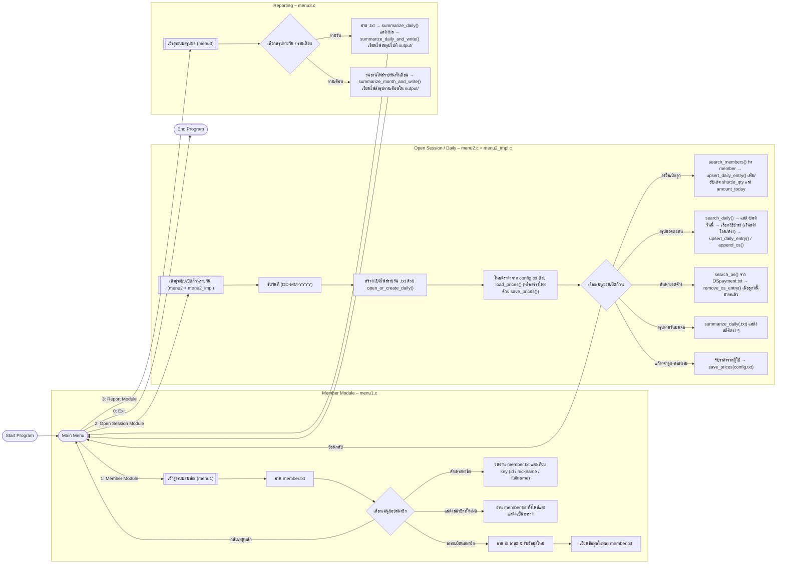

# ระบบจัดการก๊วนแบดมินตัน (Badminton Group Payment System)

> สรุปโครงสร้างระบบ, การทำงานภายใน, โมดูลต่าง ๆ และ Flowchart (Mermaid)  
> สำหรับใช้เป็นเอกสารประกอบโปรเจกต์ / README บน GitHub

---

## 1. โครงสร้างไฟล์ของโปรเจกต์

โครงสร้างไฟล์หลักของโปรเจกต์มีดังนี้

```text
main.c
menu1.c
menu1.h
menu2.c
menu2.h
menu2_impl.c
menu3.c
menu3.h

member.txt
OSpayment.txt
config.txt

output/
  ├─ <DATE>.สรุปแบบละเอียด.txt
  ├─ <DATE>.สรุปแบบย่อ.txt
  └─ <MM-YYYY>.สรุปรายเดือน.txt
```

---

## 2. หน้าที่ของไฟล์แต่ละตัว

### 2.1 `main.c` – เมนูหลักของระบบ

- แสดงเมนูหลักให้ผู้ใช้เลือกการทำงาน
- รับ input จากผู้ใช้ (1, 2, 3, 0)
- เรียกใช้ฟังก์ชันเมนูย่อยจากไฟล์อื่น ๆ ได้แก่  
  - `menu1_choose();` → ระบบสมาชิก  
  - `menu2_choose();` → ระบบเปิดก๊วน / จัดการรายวัน  
  - `menu3_choose();` → ระบบสรุปผล / รายงาน  
- ทำหน้าที่เป็น **จุดเริ่มต้นและจุดวนหลักของโปรแกรม**

```c
int main () {
    int menu;
    while (1) {
        printf("Badminton Group Payment System\n");
        printf("1.ระบบสมาชิก\n");
        printf("2.เปิดก๊วน\n");
        printf("3.สรุปข้อมูล\n");
        printf("0 เพื่อหยุดโปรแกรม\n");
        printf("กรอกหมายเลขตามเมนูที่ต้องการ :");
        scanf("%d" , &menu);

        input_file();   // เช็กว่า member.txt เปิดได้ไหม

        if      (menu == 1) menu1_choose();
        else if (menu == 2) menu2_choose();
        else if (menu == 3) menu3_choose();
        else if (menu == 0) break;
        else printf("กรอกหมายเลขผิดพลาด โปรดลองอีกครั้ง");
    }
    printf("End of program Goodbye :))");
}
```

---

### 2.2 `menu1.c` / `menu1.h` – ระบบสมาชิก (Member Module)

หน้าที่หลัก:

- ตรวจสอบการเปิดไฟล์ `member.txt` (`input_file()`)
- ลงทะเบียนสมาชิกใหม่ (`register_member()`)
- ค้นหาสมาชิกจากไฟล์ (`search_member()`)
- แสดงสมาชิกทั้งหมด (`show_all_members()`)
- จัดการเมนูย่อยของระบบสมาชิก (`menu1_choose()`)

รูปแบบข้อมูลใน `member.txt`:

```text
id|fullname|nickname|gender|created_at

ตัวอย่าง:
1|Somchai Jaidee|Boy|1|2025-11-21
```

การทำงาน (สรุป):

- ลงทะเบียน:
  - อ่านไฟล์ `member.txt` เพื่อหา id ล่าสุด
  - รับ `fullname`, `nickname`, `gender` จากผู้ใช้
  - สร้างวันที่สมัคร `created_at` (YYYY-MM-DD)
  - เขียนบรรทัดใหม่ลงไฟล์ `member.txt`
- ค้นหา:
  - เลือกค้นด้วย id / ชื่อเล่น / ชื่อ–นามสกุล
  - อ่านทุกบรรทัดจาก `member.txt` แล้วใช้ `strstr` หรือเทียบกับ id
- แสดงทั้งหมด:
  - อ่านไฟล์ทั้งไฟล์
  - แสดงในรูปแบบตาราง พร้อมจำนวนสมาชิกทั้งหมด

---

### 2.3 `menu2.h` – โครงสร้างข้อมูลและฟังก์ชันสำคัญ

กำหนด `struct` และ `enum` ที่ใช้ในระบบเปิดก๊วนและการสรุป เช่น

```c
typedef enum {
    BY_ID = 1,
    BY_NICKNAME = 2,
    BY_FULLNAME = 3
} SearchBy;

typedef enum {
    PAY_NONE = 0,
    PAY_CASH = 1,
    PAY_TRANSFER = 2,
    PAY_OS = 3
} PayMethod;

typedef struct {
    int id;
    char fullname[NAME_MAXLEN];
    char nickname[NICK_MAXLEN];
    int gender;
    char created_at[DATE_MAXLEN];
} Member;
```

โครงสร้างสำคัญเพิ่มเติม:

- `DailyEntry` – ใช้เก็บข้อมูลการเล่นในแต่ละวัน
- `OSEntry` – ใช้เก็บข้อมูลยอดค้างจ่าย (Outstanding) ในไฟล์ `OSpayment.txt`
- `Prices` – เก็บราคาลูกแบด & ค่าสนามต่อคนจากไฟล์ `config.txt`

ประกาศฟังก์ชันสำคัญ เช่น

```c
int open_or_create_daily(const char *daily_path);
int load_prices(const char *config_path, Prices *out);
int save_prices(const char *config_path, const Prices *in);

int search_members(const char *member_path, SearchBy by, const char *key, Member **out_arr, size_t *out_count);
int search_daily(const char *daily_path, SearchBy by, const char *key, DailyEntry **out_arr, size_t *out_count);
int search_os(const char *os_path, SearchBy by, const char *key, OSEntry **out_arr, size_t *out_count);

int upsert_daily_entry(const char *daily_path, const Prices *prices, const Member *m, int add_shuttle_qty, PayMethod method, int pay_today, int pay_os);

int append_os(const char *os_path, const Member *m, const char *date_ddmmyyyy, int os_amount, const char *note);
int remove_os_entry(const char *os_path, const OSEntry *entry);

int summarize_daily(const char *daily_path, int verbose);
```

---

### 2.4 `menu2_impl.c` – สมองหลักของระบบเปิดก๊วน (Logic ภายใน)

ไฟล์นี้คือ **แกนประมวลผลหลัก** ของระบบเปิดก๊วน / รายวัน ประกอบด้วยฟังก์ชันสำคัญต่อไปนี้

#### 2.4.1 จัดการไฟล์รายวัน `<DATE>.txt`

- `open_or_create_daily(const char *daily_path)`  
  - ถ้าไฟล์รายวันมีอยู่แล้ว → เปิดแล้วปิด (ยืนยันว่ามีไฟล์)
  - ถ้ายังไม่มี → สร้างไฟล์ใหม่พร้อมหัวคอลัมน์ เช่น  
    ```text
    member_id|fullname|nickname|gender|shuttle_qty|court_fee|amount_today|paid_today|paid_os|method_today
    ```

- `search_daily(...)`  
  - อ่านไฟล์รายวันทีละบรรทัด
  - แปลงเป็น `DailyEntry`
  - เลือกเฉพาะ record ที่ตรงกับเงื่อนไข (id / nickname / fullname)

- `upsert_daily_entry(...)`  
  - อ่านไฟล์รายวันทั้งหมดเข้าหน่วยความจำเป็น array ของบรรทัด
  - ถ้าเจอ `member_id` ที่ตรงกับคนเดิม
    - อัปเดตจำนวนลูก (`shuttle_qty += add_shuttle_qty`)
    - คำนวณยอดใหม่ (`amount_today = shuttle_qty * shuttle_price + court_fee_per_person`)
    - ปรับวิธีชำระ (`method_today`), ยอดที่จ่ายวันนี้ (`paid_today`), ยอดที่จ่ายจาก OS (`paid_os`) ตาม parameter
  - ถ้าไม่พบ `member_id` นี้เลย
    - เขียนบรรทัดใหม่เพิ่มท้ายไฟล์ด้วยข้อมูลสมาชิกใหม่ในวันนั้น

#### 2.4.2 จัดการยอดค้างจ่าย (Outstanding)

- `append_os(...)`  
  - เพิ่ม record ใหม่ลงในไฟล์ `OSpayment.txt` เช่น  
    ```text
    member_id|fullname|nickname|gender|date|os_amount|note
    ```

- `search_os(...)`  
  - อ่านไฟล์ `OSpayment.txt` แล้วกรองเฉพาะรายการที่ตรงกับ id / nickname / fullname

- `remove_os_entry(...)`  
  - คัดกรองทุกบรรทัดใน `OSpayment.txt`
  - เขียนไฟล์ใหม่โดย “ไม่รวม” record ที่ต้องการลบ

#### 2.4.3 ตั้งค่าราคา (config.txt)

- `load_prices(...)`  
  - อ่านไฟล์ `config.txt` เช่น  
    ```text
    SHUTTLE_PRICE=5
    COURT_FEE_PER_PERSON=50
    ```

- `save_prices(...)`  
  - เขียนค่าราคา (ลูกแบด + ค่าสนามต่อคน) ลงไฟล์ `config.txt`

#### 2.4.4 สรุปข้อมูลรายวันบนหน้าจอ

- `summarize_daily(const char *daily_path, int verbose)`  
  - อ่านไฟล์ `<DATE>.txt` ทั้งไฟล์
  - นับสถิติต่าง ๆ เช่น
    - จำนวนผู้เล่นทั้งหมด
    - จำนวนลูกทั้งหมด
    - ค่าเฉลี่ยลูกต่อคน
    - ยอดรวมที่ต้องได้รับ
    - ยอดที่ได้รับจริง (เงินสด / โอน)
    - ยอดค้างจ่ายของวันนั้น
  - แสดงผลบนหน้าจอ (เมื่อ `verbose = 1`)

---

### 2.5 `menu2.c` – ส่วนติดต่อผู้ใช้ของระบบเปิดก๊วน (UI)

ไฟล์นี้จะ

1. รับวันที่จากผู้ใช้ (รูปแบบ `DD-MM-YYYY`)
2. สร้าง path ของไฟล์รายวัน เช่น `"20-11-2025.txt"`
3. เรียก `open_or_create_daily()` เพื่อสร้าง/ตรวจสอบไฟล์รายวัน
4. โหลดราคาจาก `config.txt` (ถ้าไม่มี ให้สร้างใหม่ด้วยค่า default)
5. แสดงเมนูย่อยของ “เปิดก๊วน” เช่น
   - ลงชื่อเบิกลูก
   - สรุปยอดที่ต้องชำระ (รายบุคคล)
   - ค้นหายอดค้างชำระ
   - สรุปข้อมูลรายวัน
   - เปลี่ยนราคาลูก
   - เปลี่ยนค่าสนามต่อคน

และเรียกใช้ฟังก์ชันจาก `menu2_impl.c` ตามเมนูที่ผู้ใช้เลือก เช่น

- `search_members()` + `upsert_daily_entry()`
- `search_daily()` + `append_os()` + `upsert_daily_entry()`
- `search_os()` + `remove_os_entry()`
- `summarize_daily()`
- `save_prices()`

---

### 2.6 `menu3.c` / `menu3.h` – ระบบสรุปผลและรายงาน (Reporting Module)

หน้าที่หลัก:

- สรุปข้อมูล **รายวัน**
  - อ่านไฟล์ `<DATE>.txt`
  - ใช้ `summarize_daily()` แสดงผลบนหน้าจอ
  - ใช้ `summarize_daily_and_write()` เขียนสรุปลงไฟล์ใน `output/`
- สรุปข้อมูล **รายเดือน**
  - วนอ่านไฟล์ `<DD-MM-YYYY>.txt` ตามวันในเดือน
  - รวมยอด เช่น ลูกทั้งหมด ยอดทั้งหมด ค่าสนามรวม ยอดที่รับจริง และยอดค้าง
  - ใช้ `summarize_month_and_write()` เขียนไฟล์สรุปรายเดือนใน `output/`

ผู้ใช้จะเลือกผ่านเมนูย่อยของ `menu3_choose()` ว่าจะ
- สรุปแบบมีรายชื่อ (ละเอียด)
- สรุปแบบย่อ
- สรุปแบบรายเดือน

---

### 2.7 โครงสร้างไฟล์ข้อมูล (Data Files)

1. `member.txt`  
   - เก็บข้อมูลสมาชิกทั้งหมด
   - โครงสร้าง:  
     ```text
     id|fullname|nickname|gender|created_at
     ```

2. `<DATE>.txt` เช่น `20-11-2025.txt`  
   - เก็บข้อมูลการเล่นในวันนั้น ๆ
   - โครงสร้าง:  
     ```text
     member_id|fullname|nickname|gender|shuttle_qty|court_fee|amount_today|paid_today|paid_os|method_today
     ```

3. `OSpayment.txt`  
   - เก็บข้อมูลยอดค้างจ่ายของสมาชิก
   - โครงสร้าง:  
     ```text
     member_id|fullname|nickname|gender|date|os_amount|note
     ```

4. `config.txt`  
   - เก็บค่าตั้งราคา
   - โครงสร้าง:  
     ```text
     SHUTTLE_PRICE=<int>
     COURT_FEE_PER_PERSON=<int>
     ```

5. โฟลเดอร์ `output/`  
   - เก็บไฟล์สรุปรายวันและรายเดือนที่ระบบสร้างให้ เช่น  
     - `20-11-2025.สรุปแบบละเอียด.txt`  
     - `20-11-2025.สรุปแบบย่อ.txt`  
     - `11-2025.สรุปรายเดือน.txt`  

---

## 3. Flowchart ภายในระบบ (Mermaid)

> โฟลว์นี้แสดง **โครงสร้างภายในทั้งหมด** ตั้งแต่ Main Menu ไปจนถึง Member Module, Open Session Module (รวม logic ใน `menu2_impl.c`) และ Reporting Module

### 3.1 ภาพรวม + รายละเอียดทุกโมดูล



---

## 4. ขั้นตอนการทำงานโดยสรุป (Data Flow แบบข้อความ)

1. ผู้ใช้เปิดโปรแกรม → เข้าสู่ `main.c` → แสดง Main Menu  
2. เลือกเมนู:
   - ถ้าเลือก **เมนู 1 – ระบบสมาชิก**
     - เรียก `menu1_choose()`
     - สามารถ:
       - ลงทะเบียนสมาชิกใหม่ → เขียนลง `member.txt`
       - ค้นหาสมาชิก → อ่านข้อมูลจาก `member.txt`
       - แสดงสมาชิกทั้งหมด → อ่าน `member.txt` ทั้งไฟล์
   - ถ้าเลือก **เมนู 2 – เปิดก๊วน (รายวัน)**
     - เรียก `menu2_choose()`
     - รับวันที่ → สร้าง/เปิด `<DATE>.txt`
     - โหลดราคาจาก `config.txt`
     - ทำงานตามเมนูย่อย เช่น ลงชื่อเบิกลูก / สรุปยอดต่อคน / ค้นหายอดค้าง / สรุปรายวัน / แก้ไขราคา
     - ใช้ฟังก์ชันใน `menu2_impl.c` เพื่ออ่าน/เขียนไฟล์ และคำนวณยอดต่าง ๆ
   - ถ้าเลือก **เมนู 3 – สรุปข้อมูล**
     - เรียก `menu3_choose()`
     - สรุปรายวัน:
       - ใช้ `<DATE>.txt` → `summarize_daily()` → เขียนไฟล์สรุปใน `output/`
     - สรุปรายเดือน:
       - วนอ่าน `<DATE>.txt` ทั้งเดือน → `summarize_month_and_write()` → เขียนไฟล์สรุปรายเดือนใน `output/`
   - ถ้าเลือก **0** → จบโปรแกรม

3. ระบบใช้ไฟล์ข้อความเป็นฐานข้อมูล ได้แก่ `member.txt`, `<DATE>.txt`, `OSpayment.txt`, `config.txt` และไฟล์สรุปใน `output/`

---

## 5. หมายเหตุสำหรับการนำไปใช้ต่อ

- ไฟล์ `.md` นี้สามารถใช้เป็น:
  - เอกสาร README บน GitHub
  - แนบเป็นภาคผนวกในรายงานโครงงาน / โปรเจกต์วิชา
  - คู่มืออธิบายระบบให้เพื่อนในทีม / อาจารย์ดูโครงสร้างโปรแกรม
- Mermaid Flowchart สามารถเรนเดอร์เป็นรูปได้อัตโนมัติใน:
  - GitHub (ในบาง environment / ผ่าน action หรือ extension)
  - VS Code (ติดตั้ง Mermaid / Markdown Preview Enhanced)
  - MkDocs / Docusaurus / Obsidian (ที่รองรับ Mermaid)
