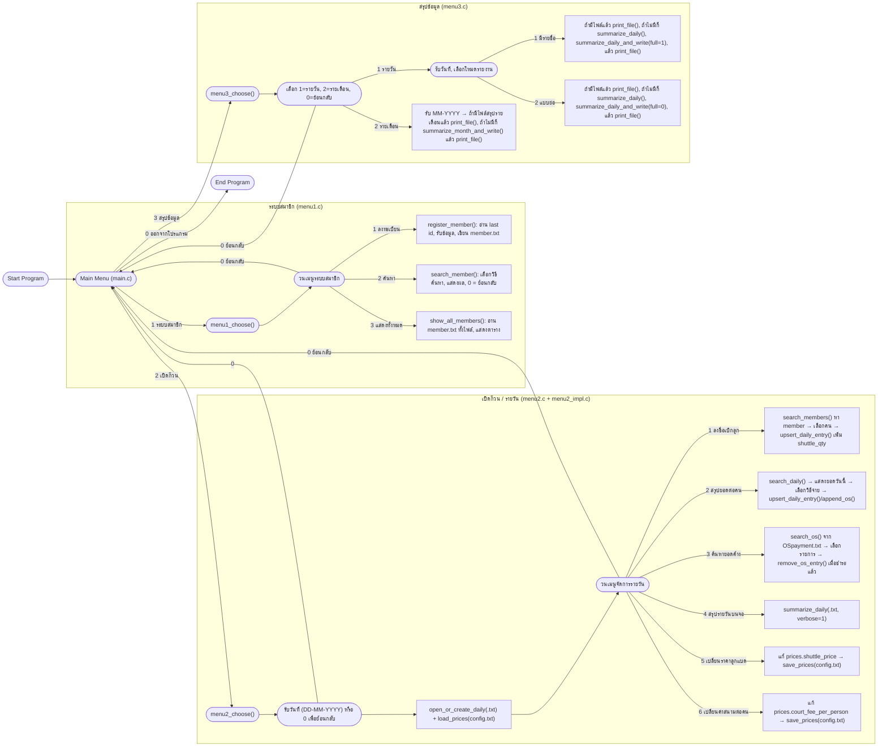

# ระบบจัดการก๊วนแบดมินตัน (Badminton Group Payment System)

> เวอร์ชันอัปเดตให้ตรงกับโค้ดล่าสุด  
> (main.c, menu1.c, menu2.c, menu2_impl.c, menu3.c, delay.c, *.h, และไฟล์ข้อมูล)

---

## 1. โครงสร้างไฟล์ของโปรเจกต์

```text
main.c
delay.c
delay.h          (ถ้ามีในโปรเจกต์จริง)

menu1.c
menu1.h

menu2.c
menu2.h
menu2_impl.c

menu3.c
menu3.h

member.txt       (เก็บข้อมูลสมาชิก)
OSpayment.txt    (เก็บยอดค้างจ่าย)
config.txt       (เก็บราคาลูกแบด/ค่าสนามต่อคน)

output/
  ├─ <DATE>.สรุปแบบละเอียด.txt
  ├─ <DATE>.สรุปแบบย่อ.txt
  └─ <MM-YYYY>.สรุปรายเดือน.txt
```

---

## 2. ภาพรวมการทำงานของระบบ

1. โปรแกรมเริ่มที่ `main.c`  
   - แสดง **เมนูหลัก**  
   - รับตัวเลขจากผู้ใช้  
   - เรียกเมนูย่อย หรือออกจากโปรแกรม

2. แบ่งออกเป็น 3 โมดูลหลัก

   - **เมนู 1: ระบบสมาชิก** – `menu1.c` / `menu1.h`  
     - ลงทะเบียนสมาชิกใหม่  
     - ค้นหาสมาชิก  
     - แสดงสมาชิกทั้งหมด  

   - **เมนู 2: เปิดก๊วน / จัดการรายวัน** – `menu2.c` + `menu2_impl.c` + `menu2.h`  
     - เลือกวันที่  
     - ลงชื่อเบิกลูก  
     - สรุปยอดต่อคน + จัดการค้างจ่าย  
     - ค้นหายอดค้างทั้งหมด  
     - สรุปรายวันบนหน้าจอ  
     - เปลี่ยนราคาลูกแบดและค่าสนาม  

   - **เมนู 3: สรุปข้อมูล** – `menu3.c` / `menu3.h`  
     - สรุปรายวัน (แบบมีรายชื่อ / แบบย่อ)  
     - สรุปรายเดือน  

3. ทุกเมนูระดับบน ๆ จะมีตัวเลือก `0` เพื่อ “ย้อนกลับ”  
   - จากเมนูย่อย → กลับเมนูก่อนหน้า  
   - จากเมนูหลัก → ออกจากโปรแกรม  

---

## 3. รายละเอียดแต่ละไฟล์

### 3.1 `main.c` – เมนูหลัก

- `main()`  
  - วนลูปแสดงข้อความ เช่น

    ```c
    printf("Badminton Group Payment System\n");
    printf("กรอกหมายเลขเพื่อทำระบบต่อไปนี้\n");
    printf("1.ระบบสมาชิก\n");
    printf("2.เปิดก๊วน\n");
    printf("3.สรุปข้อมูล\n");
    printf("0 เพื่อหยุดโปรแกรม\n");
    ```

  - อ่านตัวเลือก `menu`  
  - ถ้า `1` → `menu1_choose()`  
  - ถ้า `2` → `menu2_choose()`  
  - ถ้า `3` → `menu3_choose()`  
  - ถ้า `0` → `break;` ออกจากลูป จบโปรแกรม  
  - อื่น ๆ → แสดงข้อความ “กรอกหมายเลขผิดพลาด โปรดลองอีกครั้ง”

---

### 3.2 `delay.c` / `delay.h` – ฟังก์ชันหน่วงเวลา

- มีฟังก์ชัน

  ```c
  void delay(int number_of_seconds) {
      int milli_seconds = 1000 * number_of_seconds;
      clock_t start_time = clock();
      while (clock() < start_time + milli_seconds);
  }
  ```

- สามารถใช้ในอนาคตเพื่อ:
  - หน่วงเวลาให้ข้อความแสดงช้าลง
  - ทำ effect ก่อนเคลียร์หน้าจอ ฯลฯ  

(ในโค้ดล่าสุดที่แนบ ยังไม่ได้ใช้งานจริงใน `main.c` แต่สามารถ include แล้วเรียกใช้ได้)

---

### 3.3 `menu1.c` / `menu1.h` – ระบบสมาชิก

ฟังก์ชันหลักที่เห็นจากโค้ดล่าสุด:

- `input_file()`  
  - ทดสอบเปิด `member.txt` เพื่อเช็กว่าไฟล์อยู่จริงหรือไม่  

- `register_member()`  
  - อ่านไฟล์ `member.txt` เพื่อนับ `last_id`  
  - รับข้อมูลจากผู้ใช้:
    - ชื่อ–นามสกุล (`fullname`)  
    - ชื่อเล่น (`nickname`)  
    - เพศ (`gender`)  
  - สร้างวันที่สมัคร `created_at` จากเวลาในระบบ  
  - เขียนบรรทัดใหม่ลงไฟล์:

    ```text
    id|fullname|nickname|gender|created_at
    ```

- `search_member()`  
  - แสดงเมนูให้เลือกวิธีค้นหา เช่น
    - ค้นด้วยรหัสสมาชิก  
    - ค้นด้วยชื่อเล่น  
    - ค้นด้วยชื่อ–นามสกุล  
    - `0` = ย้อนกลับ  
  - รับ keyword จากผู้ใช้  
  - เปิด `member.txt` แล้ววนอ่านทีละบรรทัด  
  - ใช้ `sscanf(...)` แยกข้อมูล และเทียบกับ keyword  
  - แสดงผลที่ตรงเงื่อนไขทั้งหมด

- `show_all_members()`  
  - เปิด `member.txt`  
  - อ่านทุกบรรทัด  
  - แสดงตารางสมาชิกทั้งหมด พร้อมจำนวนรวม

- `menu1_choose()`  
  - วนลูปเมนูระบบสมาชิก (ในโค้ดล่าสุดใช้ `while(1)` + `break`)  
  - ตัวเลือก:
    - `1` → `register_member()`  
    - `2` → `search_member()`  
    - `3` → `show_all_members()`  
    - `0` → ย้อนกลับไป `main()`  

> หมายเหตุ: ถ้าอยากให้ทำได้หลาย action ต่อรอบ (ทำเสร็จแล้วกลับมาแสดงเมนูอีกรอบ)  
> ต้องเอา `break;` ที่อยู่ภายในเงื่อนไข 1/2/3 ออก  
> ปล่อยให้ `while(1)` ทำงานต่อจนกด 0

---

### 3.4 `menu2.h` – โครงสร้างข้อมูลและ Prototype

ภายในมี:

- ค่าคงที่

  ```c
  #define NAME_MAXLEN 128
  #define NICK_MAXLEN 64
  #define DATE_MAXLEN 16
  #define NOTE_MAXLEN 128
  ```

- `enum SearchBy`  
  ใช้กำหนดวิธีค้นหา: `BY_ID`, `BY_NICKNAME`, `BY_FULLNAME`

- `enum PayMethod`  
  ใช้กำหนดวิธีชำระ: `PAY_NONE`, `PAY_CASH`, `PAY_TRANSFER`, `PAY_OS`

- `struct Member`  
  ใช้ร่วมกับ `member.txt`

- `struct DailyEntry`  
  ใช้เก็บข้อมูลของแต่ละคนในไฟล์ `<DATE>.txt` เช่น
  - `member_id, fullname, nickname, gender`  
  - `shuttle_qty` (จำนวนลูก)  
  - `court_fee` (ค่าสนามต่อคน)  
  - `amount_today` (ยอดที่ต้องจ่ายวันนี้)  
  - `paid_today`, `paid_os`, `method_today`

- `struct OSEntry`  
  สำหรับข้อมูลใน `OSpayment.txt` เช่น
  - `member_id, fullname, nickname, gender`  
  - `date`  
  - `os_amount`  
  - `note`

- `struct Prices`  
  ราคาลูกแบดและค่าสนามต่อคน (`shuttle_price`, `court_fee_per_person`)

- ฟังก์ชันสำคัญที่ประกาศใน header (ใช้ในหลายไฟล์):

  ```c
  int open_or_create_daily(const char *daily_path);
  int load_prices(const char *config_path, Prices *out);
  int save_prices(const char *config_path, const Prices *in);

  int search_members(const char *member_path, SearchBy by, const char *key, Member **out_arr, size_t *out_count);
  int search_daily(const char *daily_path, SearchBy by, const char *key, DailyEntry **out_arr, size_t *out_count);
  int search_os(const char *os_path, SearchBy by, const char *key, OSEntry **out_arr, size_t *out_count);

  int upsert_daily_entry(const char *daily_path, const Prices *prices, const Member *m,
                         int add_shuttle_qty, PayMethod method, int pay_today, int pay_os);

  int append_os(const char *os_path, const Member *m, const char *date_ddmmyyyy, int os_amount, const char *note);
  int remove_os_entry(const char *os_path, const OSEntry *entry);

  int summarize_daily(const char *daily_path, int verbose);

  void menu2_choose(void);
  ```

---

### 3.5 `menu2_impl.c` – Logic หลักของเมนูเปิดก๊วน/รายวัน

ฟังก์ชันที่สำคัญ:

- `open_or_create_daily(daily_path)`  
  - ถ้าไฟล์ `<DATE>.txt` มีแล้ว → เปิดแล้วปิด (ถือว่าใช้ต่อได้)  
  - ถ้าไม่มี → สร้างไฟล์ใหม่และเขียนหัวคอลัมน์  

- `load_prices(config.txt)` และ `save_prices(config.txt)`  
  - อ่าน/เขียนค่าราคาลูกแบดและค่าสนามต่อคน  

- `search_members()` / `search_daily()` / `search_os()`  
  - อ่านไฟล์ตามชนิด (สมาชิก, รายวัน, OS)  
  - แปลงเป็น struct array (`Member[]`, `DailyEntry[]`, `OSEntry[]`)  
  - กรองตามเงื่อนไขค้นหาที่ผู้ใช้เลือก  

- `upsert_daily_entry()`  
  - โหลดทุกบรรทัดจากไฟล์ `<DATE>.txt`  
  - ถ้าเจอข้อมูลคนเดิม (`member_id` เดิม) → อัปเดต  
    - เพิ่มจำนวนลูก (`shuttle_qty`)  
    - คำนวณยอด (`amount_today`) ใหม่  
    - อัปเดตวิธีชำระ (`method_today`, `paid_today`, ฯลฯ)  
  - ถ้าไม่เจอ → เพิ่มบรรทัดใหม่ในไฟล์  

- `append_os()` / `remove_os_entry()`  
  - เพิ่มยอดค้างใหม่ลง `OSpayment.txt`  
  - ลบยอดค้างเมื่อสมาชิกชำระหนี้แล้ว  

- `summarize_daily(daily_path, verbose)`  
  - ใช้อ่านไฟล์ `<DATE>.txt`  
  - นับจำนวนผู้เล่น, จำนวนลูก, ค่าสนามรวม, ยอดที่ควรได้รับ, ยอดที่รับจริง, ยอดค้าง ฯลฯ  
  - ถ้า `verbose=1` → แสดงรายละเอียดบนหน้าจอ (ใช้ในเมนู 2 และเมนู 3)

---

### 3.6 `menu2.c` – เมนู UI สำหรับเปิดก๊วน / รายวัน

ลำดับการทำงานหลัก ๆ:

1. รับวันที่ (รูปแบบ `DD-MM-YYYY`), ถ้าผู้ใช้พิมพ์ `0` ให้ย้อนกลับเมนูก่อนหน้า  
2. สร้างชื่อไฟล์ `<DATE>.txt` และเรียก `open_or_create_daily()`  
3. ใช้ `load_prices("config.txt", &prices)` ถ้าไม่เจอให้ตั้งค่ามาตรฐานแล้ว `save_prices()`  
4. เข้าลูปเมนูย่อย (while(1)):

   - `1` ลงชื่อเบิกลูก  
     - เลือกวิธีค้นหา (id / ชื่อเล่น / ชื่อเต็ม)  
     - ใช้ `search_members()` หาใน `member.txt`  
     - ให้ผู้ใช้เลือกสมาชิกจากรายการที่พบ  
     - รับจำนวนลูกที่เพิ่ม  
     - เรียก `upsert_daily_entry()` เพื่อบันทึกลง `<DATE>.txt`  

   - `2` สรุปยอดต่อคน  
     - ใช้ `search_daily()` หา record ของคนที่ต้องการ  
     - แสดงยอดที่ต้องจ่ายวันนี้  
     - เลือกวิธีชำระ:
       - เงินสด → `upsert_daily_entry(..., PAY_CASH, ...)`  
       - โอน → `upsert_daily_entry(..., PAY_TRANSFER, ...)`  
       - ค้าง → `append_os("OSpayment.txt", ...)` + `upsert_daily_entry(..., PAY_OS, ...)`  

   - `3` ค้นหายอดค้าง  
     - ใช้ `search_os()` อ่านจาก `OSpayment.txt`  
     - ให้ผู้ใช้เลือก record  
     - ถ้าชำระแล้ว → `remove_os_entry()` ลบจากไฟล์  

   - `4` สรุปรายวันบนหน้าจอ  
     - เรียก `summarize_daily(daily_path, 1)`  

   - `5` เปลี่ยนราคาลูกแบด  
     - แสดงราคาปัจจุบัน  
     - รับค่าราคาใหม่  
     - บันทึกลง `config.txt`  

   - `6` เปลี่ยนค่าสนามต่อคน  
     - แสดงค่าสนามปัจจุบัน  
     - รับค่าใหม่  
     - บันทึกลง `config.txt`  

   - `0` ย้อนกลับ  
     - `return;` กลับไป `main()`  

---

### 3.7 `menu3.c` / `menu3.h` – สรุปข้อมูล

ฟังก์ชันภายในที่สำคัญ:

- `file_exists(path)` / `print_file(path)`  
  - helper สำหรับเช็กไฟล์และแสดงไฟล์สรุป  

- `summarize_daily_and_write(daily_path, out_path, full)`  
  - อ่าน `<DATE>.txt`  
  - คำนวณสถิติเหมือน `summarize_daily()`  
  - ถ้า `full=1` → เขียนไฟล์สรุปแบบมีรายชื่อทุกคน + สรุปท้ายไฟล์  
  - ถ้า `full=0` → เขียนแบบย่อ (เฉพาะตัวเลขรวม)  

- `summarize_month_and_write(month_yyyy, out_path)`  
  - วน `day = 01..31` สร้างชื่อไฟล์ `<DD-MM-YYYY>.txt`  
  - ถ้ามีไฟล์ → รวบสถิติทั้งเดือน  
  - ดูยอดจาก `OSpayment.txt` ที่อยู่ในเดือนนั้น  
  - เขียนไฟล์สรุปรายเดือนลงใน `output/`  

- `menu3_choose()`  
  - เมนูหลักของการสรุปข้อมูล:
    - `1` สรุปรายวัน
      - ถามวันที่ `DD-MM-YYYY`  
      - ถามโหมด:
        - `1` สรุปแบบมีรายชื่อ (เต็ม)  
        - `2` สรุปแบบย่อ  
      - ถ้ามีไฟล์สรุปแล้วใน `output/` → `print_file()`  
      - ถ้ายังไม่มี:
        - เรียก `summarize_daily()` (แสดงบนจอ)  
        - เรียก `summarize_daily_and_write()` เขียนไฟล์สรุป  
        - แสดงไฟล์สรุปออกหน้าจอ  
    - `2` สรุปรายเดือน
      - ถามเดือน/ปี `MM-YYYY`  
      - ถ้ามีไฟล์สรุปรายเดือนแล้ว → `print_file()`  
      - ถ้ายังไม่มี → `summarize_month_and_write()` แล้วจึง `print_file()`  
    - `0` → ย้อนกลับไป `main()`  

---

## 4. โครงสร้างข้อมูลในไฟล์ .txt

1. `member.txt`

   ```text
   id|fullname|nickname|gender|created_at
   ```

2. `<DATE>.txt` เช่น `20-11-2025.txt`

   ```text
   member_id|fullname|nickname|gender|shuttle_qty|court_fee|amount_today|paid_today|paid_os|method_today
   ```

3. `OSpayment.txt`

   ```text
   member_id|fullname|nickname|gender|date|os_amount|note
   ```

4. `config.txt`

   ```text
   SHUTTLE_PRICE=<int>
   COURT_FEE_PER_PERSON=<int>
   ```

---

## 5. Flowchart ของระบบ (Mermaid)

> โฟลวนี้สะท้อนโค้ดล่าสุด: main.c, menu1.c, menu2.c, menu2_impl.c, menu3.c  
> ใช้เป็นภาพรวม high-level ของการทำงานทั้งหมด



---

เอกสารนี้อัปเดตให้ตรงกับโค้ดล่าสุดที่มีอยู่ในโปรเจกต์ตอนนี้แล้ว  
ถ้าเจภูภูแก้โค้ดเพิ่ม (เช่น ย้าย `summarize_daily_and_write()` ไปไว้ที่อื่น หรือเพิ่มฟังก์ชันใหม่)  
บอกได้เลย เดี๋ยวจาร์วิสช่วยอัปเดตเอกสารให้ตามโค้ดเวอร์ชันใหม่อีกทีได้เลย 😄
